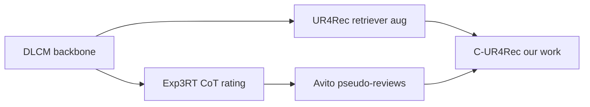

# Baseline comparison: Exp3RT vs UR4Rec vs DLCM

**Date:** 2026-06-16  
**Protocol reference:** UR4Rec paper Appendix C — NDCG@5/10, MAP@10; 8:1:1 user split (ML-1M) or SERP split (Avito).

This table consolidates **our reproductions** on shared infrastructure. Paper-reported Exp3RT numbers are listed separately where we have not yet trained the official pipeline.

---

## MovieLens-1M (rerank smoke, Qwen2.5-7B knowledge)

Config: `configs/ur4rec_ml1m_beat_base.yaml` (beat run in progress); smoke reference: `configs/ur4rec_smoke_qwen.yaml`  
Metrics: `checkpoints/ur4rec_smoke_qwen/metrics_test.json`  
Split: 8:1:1 users, top-20 candidates per user, DLCM backbone.

| Method | NDCG@5 | NDCG@10 | MAP@10 | Notes |
|--------|--------|---------|--------|-------|
| DLCM (base) | 0.293 | **0.362** | 0.246 | Position + BERT encoder |
| UR4Rec (smoke, 1 epoch) | 0.278 | 0.337 | 0.237 | Retriever + aug; below base on smoke |
| Exp3RT (official) | — | — | — | Not run: needs Llama-3 LoRA + vLLM |
| Exp3RT-style (Avito script on ML-1M) | — | — | — | Not ported yet |

**Takeaway:** On ML-1M smoke, UR4Rec underperforms DLCM — motivates confidence gating (C-UR4Rec backlog). Full beat baseline pending knowledge merge + train.

---

## Avito SERP (smoke, contacts label)

Items: `items_with_attrs.parquet`, users: `users_with_history.parquet`  
Test cap: 100 SERPs (seed 42).

| Method | NDCG@5 | NDCG@10 | MAP@10 | Source |
|--------|--------|---------|--------|--------|
| DLCM (base) | 0.931 | 0.929 | 0.884 | `checkpoints/ur4rec_avito_smoke_qwen/metrics_test.json` |
| UR4Rec (smoke, Qwen) | 0.926 | 0.930 | 0.886 | same |
| Exp3RT-style heuristic | **0.952** | **0.946** | **0.910** | `reproduction/results/avito_exp3rt_mvp.json` |
| Exp3RT-style LLM (5 SERPs) | 0.932 | 0.897 | 0.840 | `reproduction/results/avito_exp3rt_llm_smoke.json` |
| Exp3RT (official fine-tune) | — | — | — | Blocked: no Avito reviews for SFT |

**Caveats:**

- UR4Rec/DLCM: 20 subsampled candidates per SERP, trained joint model.
- Exp3RT MVP: full SERP rerank, untrained heuristic (brand/query/price features).
- Avito NDCG values are high because labels are sparse within SERP; compare **relative** gains, not absolute levels vs ML-1M.

**Takeaway:** Attribute-aware pseudo-review rerank improves over block position (+5.8 NDCG@10 vs position baseline in MVP script). UR4Rec smoke ≈ DLCM; room for C-UR4Rec query-conditioned retrieval.

---

## Amazon-Books (Exp3RT native dataset)

Repo smoke: `reproduction/amazon_smoke.md` — data pipeline **PASS**, training **not run**.

| Method | Status | Notes |
|--------|--------|-------|
| Exp3RT paper (Amazon-Books rerank) | Reported in SIGIR 2025 | Top-k over MF/LGN candidates; see paper Table 2 |
| Our DLCM / UR4Rec on Amazon | Not run | Data at `data/amazon-books/`; loaders fixed |
| Exp3RT repo inference | Blocked | Gated Llama-3-8B; bug in `train_amazon-book.sh` (`$rmse_patience`) |

Bundled preprocessed JSON in cloned repo: 94,669 train / 11,743 test rating-bias rows; top-k lists for 10,052 users.

**Next:** Stage-3 LoRA on Qwen substitute or obtain Llama-3 access; align top-100 candidate protocol with UR4Rec Amazon port.

---

## Method positioning (for talk)

| Axis | UR4Rec | Exp3RT | Our MVP |
|------|--------|--------|---------|
| Signal | LLM knowledge embeddings | Review-derived profiles + rationale | Structured attrs + contact history |
| Online cost | Retriever forward pass | LLM CoT per pair/item | Heuristic or batched LLM scores |
| Search query | Not in paper | Not in paper | `serp_query_text()` injected |

---

## Files

| Artifact | Path |
|----------|------|
| Exp3RT repo smoke | `papers/exp3rt/reproduction/amazon_smoke.md` |
| Avito MVP metrics | `papers/exp3rt/reproduction/results/avito_exp3rt_mvp.json` |
| Avito adaptation notes | `papers/exp3rt/reproduction/avito_adaptation.md` |
| UR4Rec ML-1M smoke | `checkpoints/ur4rec_smoke_qwen/metrics_test.json` |
| UR4Rec Avito smoke | `checkpoints/ur4rec_avito_smoke_qwen/metrics_test.json` |
| Improvement backlog | `docs/paper_improvements_backlog.md` |
